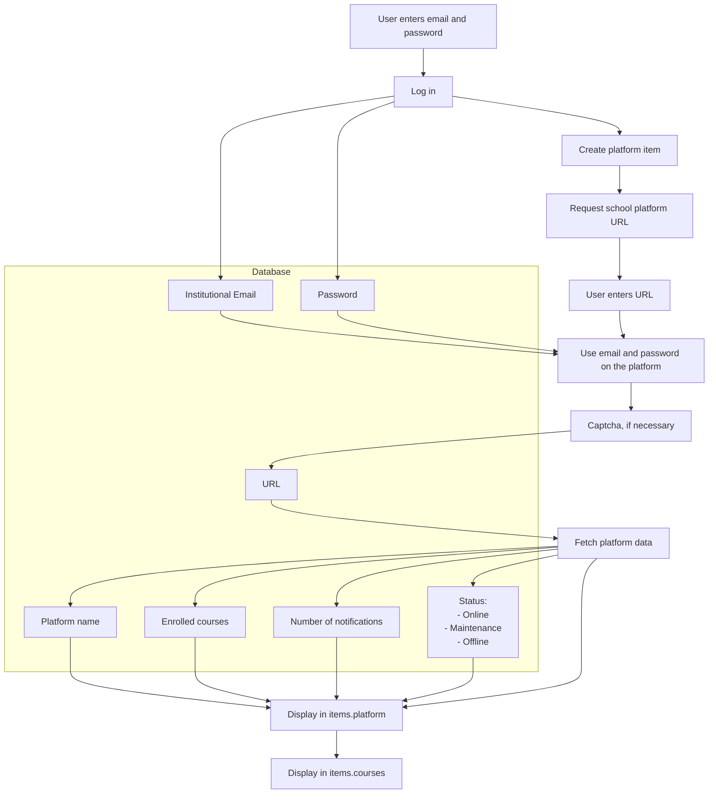
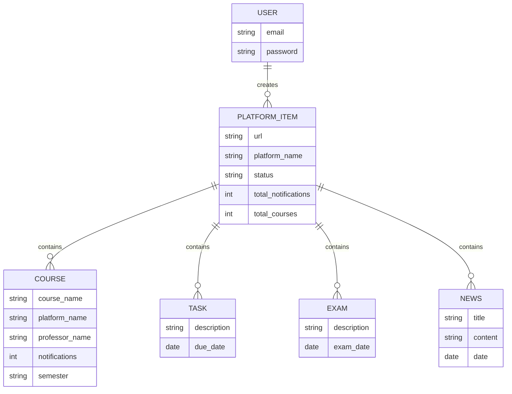

# Action Bar

- A bar containing a set of buttons that allow quick navigation through the platform.

## Description
- The action bar must have three main buttons that act as positions or states within the application.
- Only one button can be pressed at a time, and these buttons remain highlighted as long as the user is within that `action`.
- The actions are defined as the positions the application can be in. There are three in total:
  - Notifications
  - Home Page
  - Add Platform

### Notifications
- The user can access this section through the left button on the action bar.
- In the `notifications` section, the user can see different `items` containing relevant information. These `items` are divided into three types:
  - `Task`
  - `Exam`
  - `News`  
  Each notification `item` includes:
    - Platform name
    - Start date
    - Expiration date (except for news, which do not have an expiration date)
    - Course name
    - Teacher name
    - A label indicating the type of notification
- By pressing the `view` option on the notification item, the user will be redirected to the specified `platform`, `course`, and `activity/news` in the notification.
- These notifications can be easily searched through [`RF-03`], the application's search and filter system.

### Home
- The user can access this section through the central button.
- In this section, items are displayed that can contain platforms (item.platmform) or courses from these platforms (item.course).
For platform-type items:
  - :one: You can access the platforms you have previously registered by clicking or pressing them.
  - :two: The number of notifications contained in the platforms will be indicated and colored depending on the quantity:
    - <strong>Green</strong>: This color indicates that there are no pending notifications on the platform, low alert.
    - <strong>Blue</strong>: This color indicates a medium number of notifications, 1-3, medium alert.
    - <strong>Red</strong>: This color indicates the highest number of notifications, high alert.
    >*The colors are extracted from the design guide in the documentation*
  - :three: In the upper left corner, information about the platform's status will be displayed:
    - <strong>Green</strong>: Online, the platform is functioning correctly and can be accessed without problems.
    - <strong>Yellow</strong>: The platform is under maintenance, it cannot be accessed because it is being worked on. Normally, students are notified before this happens.
    - <strong>Orange</strong>: The platform is out of service due to an unspecified problem. The user cannot access the platform because it is out of service.
     >*The colors are extracted from the design guide in the documentation*
  - :four: The platform's logo is displayed.
  - :five: The platform's name is displayed.
  - :six: A brief description of the platform is displayed.

 - For course-type items:
   - :one: The characteristics :two:, :three:, and :five: from `items.platform` are inherited.
   - :two: The course name is displayed.
   - :three: The semester number of the course is displayed.
   - The name of the professor in charge of the course is displayed.
- The items can be searched and filtered as specified in [`RF-03`].

Sure, here's the translation:

### Add Platform
- The user can access this section through the right button on the action bar.
- In this section, platforms can be added by entering the URL in a text field indicated on the platform. The application will detect the platform and create the item that will be displayed in the home page section.
- The platform will use the credentials previously entered when the user first logged in (`institutional email`). If the entered platform requires a username and password different from the institutional email, the application will ask for the email or username and password to log in, and if necessary, a captcha.
- The first time the user logs into the application, the add platform section will be displayed, and the others will be locked until the process of adding a platform is completed.
## UADY HUB's data behavior:

## ER graph

[`RF-03`]: https://github.com/Ozia112/Team-2-FSE-repo/blob/FIS-Project-Stage-3/PD/PD2/OrtizIsaac.md

# Artifacts 
- User Story:
As a user, I want to quickly access different sections of the application through the Activity Bar to improve my workflow.

- Acceptance Criteria:
    - The Activity Bar must contain icons for the main sections of the application.

    - Clicking on an icon should change the view to that section.

- Use Case:

User: Person using the application and navigating through the Activity Bar.

- Scenario:

**Scenario 1**: Successful Navigation

Context: The user is on the main screen of the application.

Actions:

The user clicks on an icon in the Activity Bar.

Expected Result: The application changes to the corresponding view, and the user can interact with that section.

**Scenario** 2: Icon Customization

Context: The user wants to customize the Activity Bar.

Actions:

The user opens the settings menu of the Activity Bar.

The user drags and drops icons to rearrange them.

The user hides some icons.

Expected Result: The Activity Bar updates according to the user's preferences, and changes are reflected immediately.

Scenario 3: Personalized Activity Bar on Start

Context: The user has previously customized the Activity Bar.

Actions:

The user opens the application.

Expected Result: The Activity Bar displays the icons in the user's customized arrangement.
> Written by `TM-02`