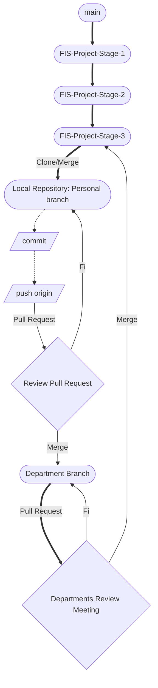

# Process Description (FIS Project Stage 3)
## Introduction
The following document will break down the general project activities and their expected outcomes. It will also provide a detailed explanation of how the iterations for the third stage of the project will work, special cases for certain tasks, and the protocols for correct naming and documentation of participation in the project.
### Sprint
During the process of the third stage of the project, the team will be organized into sprints, with two mandatory meetings held per sprint: a planning session to assign tasks to the production departments and the other will be a progress review and evaluation of artifacts produced.
### Planning Meetings:
The sprint planning meeting will be held on Mondays at 11:00 am. During these sessions, the team will discuss and agree on the distribution of tasks and activities among the team members.
### Evaluation Meetings
The evaluation meeting will be held on Fridays at 9:00 am. During these sessions, each department’s activities will be reviewed with a progress report prepared by the chief department. This approach aims to streamline the review and minimize the risk of undetected errors.
### Sprint Size
Each sprint will last an average of five days, with an additional day allocated to address issues, correct errors, and complete any delayed tasks in preparation for the next meetings.

### Planning
The work will be conducted throughout November with the goal of completing the project at least four days before the deadline. This will allow an additional sprint for error detection and resolution.

### Problem Detection
During the second delivery, issues arose with the equitable distribution of project activities, leading to an imbalance in participation that was challenging to measure precisely. Failures in calculating the weight of certain activities required more effort and time than anticipated. It was noted that high-weight activities needed to be divided among each sprint to section and adapted to them as necessary for proper progress.

Due to this, activities will now be divided by production departments. Different team members will be responsible for directing and gathering information on participation within their process. This will allow better individual monitoring, timely reporting of potential anomalies, and facilitate task reassessment in terms of weight or time as needed.

### Production Departments
- **Product/Requirements:** Improvement and refinement of requirements, scopes, and user definitions. **Lead:** TM-03.
- **Design:** Definition of visual aspects, interfaces, and quality standards of prototypes. **Lead:** TM-02.
- **Process:** Definition, description, and establishment of project protocols, activities, regulations, and timelines. **Lead:** TM-01.
- **Logs/Changelogs:** Monitoring team activities, supervising activity descriptions, and logging sprint meetings. **Lead:** TM-07.
- **Presentation and Video:** Project presentation to the audience, potential users, and clients, along with documentation quality supervision. **Lead:** TM-05.
- **Competencies:** Evaluation of competencies acquired by the team during the project, considering general activities and achieved skills. **Lead:** TM-04.

### ID’s Assignation.
The assignment of Identifiers for team members will be implemented to increase the flexibility of team job changes in case a member is absent or previously assigned roles change in the next stages of the project. The enumeration is assigned in order of integration into the team at the time it was formed. At some point in the process, members may change their identifier with prior notice in case it is needed due to an emergency.
The assignment with team members (11/30/2024) is as follows:
- `TM-01`: Isaac Ortiz
- `TM-02`: Paola Parra
- `TM-03`: Rolando Cabrera
- `TM-04`: Álvaro Pantoja
- `TM-05`: Cristofer Barrera
- `TM-06`: Adrián Rosado
- `TM-07`: Alexander Castañeda
### Roles and Responsibilities
- `Project Manager`: _Responsible for the overall management of the project, in charge of distributing tasks across the different stages among all members, taking into account their skills._
- `Repository Manager`: _Responsible for organizing the project to improve readability and ensuring that repository navigation is user-friendly for those visiting the directory._
- `Chief Department`:_Responsible of the department management, they review commits in the categories and approve the changes and creations in the branch to eventually create a PR to the main branch(FIS-Project-Stage-3)._
- `Log Keeper`: _Responsible for recording and organizing the logs of all project members in a readable and easy-to-analyze format to enable quick and efficient data analysis._
- `Task Owner`: _Members who have been assigned a specific project task._
- `Assistant`: _Members assigned to assist the task owner in solving the issues related to the specific task._
---
## Workflow
The workflow has been modified to avoid errors made in previous deliveries. Activities will now be distributed weekly, depending on completion, progress, or unexpected delays, following a weekly schedule instead of a fixed table from the start. This will reflect the actual needs of the project process.

Additionally, document creation, modification, or correction will now be managed from each team member's local repository for assigned activities, which will then be uploaded to the respective department. As a result, GitHub Desktop and GitBash applications will be used to comfortably and securely update each member's local repository through merging the main branch.

Changes concentrated in department branches will be reviewed in the revision meetings. Possible issues or necessary changes in pull requests will be evaluated to finalize or merge them into the main branch. After each revision meeting, team members must update their personal branches with the main branch to avoid compatibility errors.

### Iterations
The workflow will be structured in six-day iterations (except in specific cases), during which the different activities have been distributed. At the beginning of each iteration, a general report will be made on all changes implemented, objectives achieved, possible corrections, and the resolution of any questions the team may have regarding the previous iteration or upcoming activities.  

Process/iterations_process.png)

### Protocols 
The work protocols will be managed in brief iterations that will be reviewed every two to three days, except in emergency cases where immediate intervention is required for a specific task.
#### Rules
- Create and move your tasks in the GitHub project section as required.
- At the bottom of the document, write the name of the person who created it with the following statement: "> Written by `TM-00`". If the file was modified by an assistant, add a sub-quote: "Assistant: `TM-00`."
- After completing a commit on a task, immediately create a pull request (PR) to update the repository as soon as possible. (Changes will only be reviewed in the Stage 2 branch.)
-	Each folder must contain a README.md file, serving as an explanatory text of the folder and its table of contents to allow for smoother navigation for the reader.
##### Naming
- Name your files using PascalCase (ExampleFileName)
- The images used for tasks should be stored in specific folders depending on which file they are used in, following this structure: "assets/Stage2/ExampleTask/".
- Activity folders now will be named with their ID in parentheses followed by their category. Example: (D)Process.
-	Images should always be saved in the folder named assets, and they must have descriptive names in English to ensure image references in markdown files are well-structured.
- File names must always be written in English. If the task was originally written in Spanish, this should be specified next to the file name with “(esp)” beside the file version. The final file must be entirely in English, and it does not need to specify the language as it is assumed to be in English.
### Meetings 
At the start of each iteration, a personal meeting will be scheduled to discuss project planning. Preferably, it will be scheduled for Mondays. In the event of any circumstances preventing this, the meeting will be held via video call or rescheduled as soon as possible. The same applies to the end of each iteration, with meetings held in person on Fridays whenever possible, and in case of an emergency, via video call.
#### Possible dates for in-person/video call meetings:
- Monday, October 7 (Planning) / Friday, October 11 (Review)
- Monday, October 14 (Planning) / Friday, October 18
- Sunday, October 20 (Short iteration planning) / Tuesday, October 22 (Short iteration review and reassessment for project reassignment)

### Logs 
- The general log for both video call and in-person meetings will continue to be recorded by ``TM-03`` and now also by ``TM-07`` simultaneously.
- Time and record the duration spent on a specific task.
- Report any changes made in a personal log within the folder of the assigned sprint activity is performed. The  file name and format should follow this structure: 

  - [binnacle format]

Time lapsed: 14:25:26 30/11/2024
>Written by `TM-01`.

[binnacle format]: https://github.com/Ozia112/Team-2-FSE-repo/blob/department.Binnacle/Changelogs/(D)Process/BinnacleInformation.md