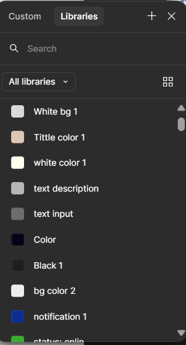
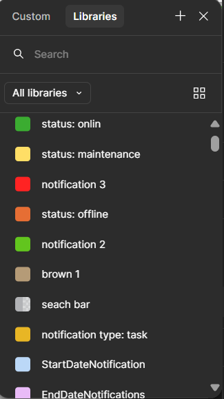
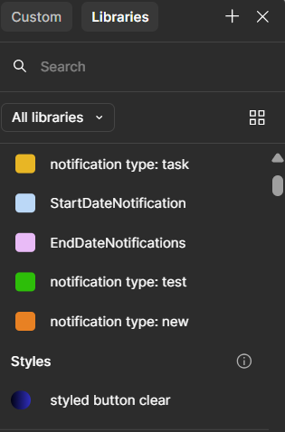
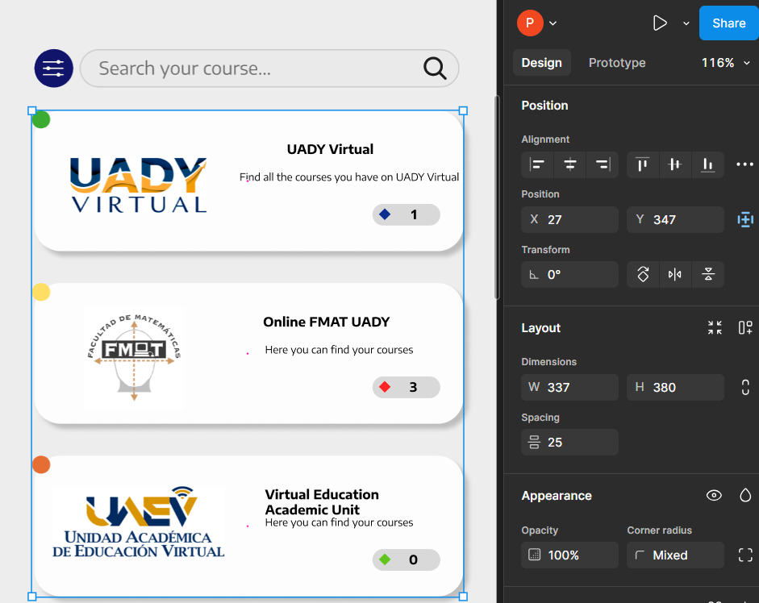
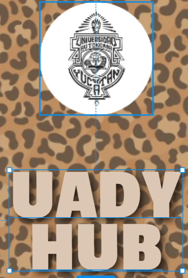

# Guía de diseño 

## **La integridad estética**
Representa qué tan bien la apariencia y el comportamiento de una aplicación se integran con su función.

## **La consistencia en el diseño**
Está basada en estándares y paradigmas familiares mediante el uso de elementos de interfaz provistos por el sistema operativo, iconos conocidos, estilos de texto estándar y terminología uniforme.

## **Interacción directa**

**La interacción directa** del usuario con el contenido en su pantalla los compromete y les facilita la comprensión de lo que están haciendo.

##  **La retroalimentación**
**La retroalimentación** ayuda a los usuarios a reconocer las acciones que son útiles y les muestra resultados para mantenerlos informados.

##  **Las metáforas**

**Las metáforas** ayudan a que las personas aprendan más rápidamente cuando los objetos y acciones virtuales de una aplicación son similares de experiencias familiares.

#  Fundamentos de Diseño 

 ###  1.Fundamentos de diseño 

  **Tipografía**: Escoge dos o tres tipos de letra que se complementen entre sí. Define el uso de cada uno (títulos, subtítulos, cuerpo de texto):
  - Tipografia UADYHUB: Passion One
  - Tipografía LOGIN: Source Sans 3
  - Tipografia General : Encode Sans Semi Expanded 
    
   **Paleta de Colores**: Selecciona una paleta de colores coherente. Puede incluir colores principales, secundarios y de acento.
  , , , 

   **Espaciado y Margen**: Define las reglas de espaciado entre elementos, así como los márgenes y el padding.
- spacing: #25  

### 2. Elementos Gráficos

  **Iconos y Gráficos**: Establece un estilo visual para iconos y gráficos, asegurándote de que sean consistentes en todo el diseño.
  - Iconos: Los iconos estandar son de color blanco o negro 

   

  **Imágenes**: Define el estilo de las imágenes (fotografías, ilustraciones) y cómo deben integrarse en el diseño.
  - Uso de ilustaciones como logos 

  
    

### 3. Componentes de la Interfaz

   **Navegación**: Crea un esquema de navegación, incluyendo menús, barras laterales y breadcrumbs.
    

### 4. Aplicación del Diseño

   **Plantillas**: Diseña plantillas para páginas específicas (inicio, notificaciones, Ajustes).

    
  

### 5. Manual de Marca

   **Logotipo**: Define el uso correcto del logotipo (tamaño mínimo, espacio alrededor, versiones de color).
    
  

