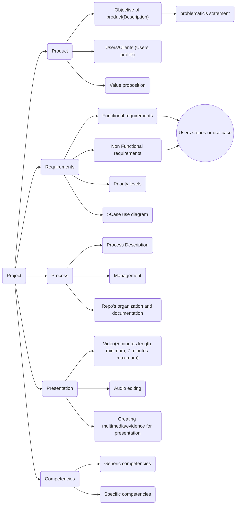

## Introduction
Hi **Team 2** This is the repo when we will work for the next months. Here we will write the functional requirements for our proposal project.
First of all here are the task we must complete to our success:

> Written by Isaac
